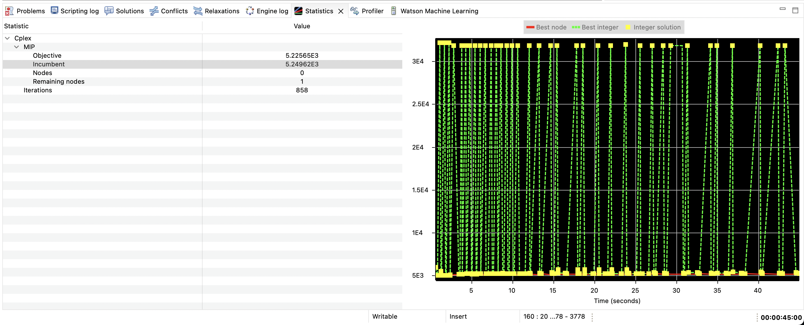
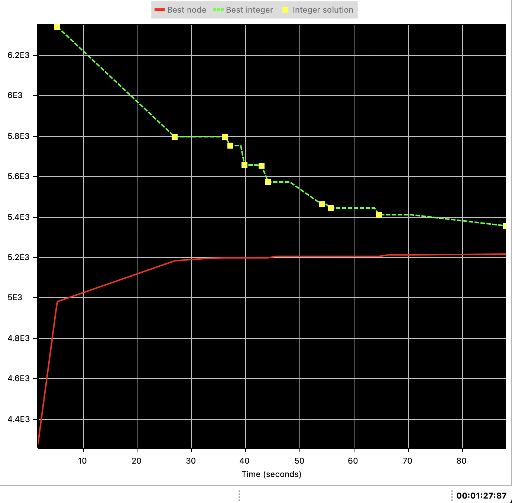
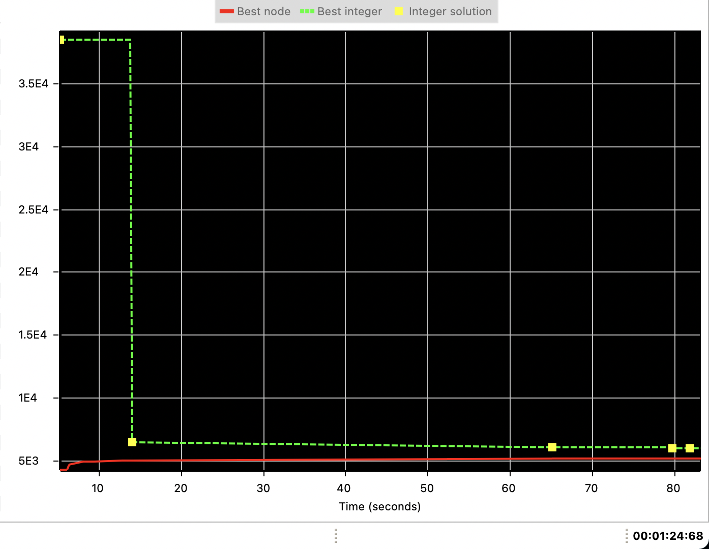

# Punto 3

### Eliminación de subtours en TSP.MOD

Dado que es un modelo, la eliminación de subtours está dada por una condicion:
```
forall ( s in subtours )
  sum ( i in Cities : s.subtour[i] != 0 ) x[< minl ( i, s.subtour[i] ), maxl ( i, s.subtour[i] ) >] <= s.size - 1;
```

En pseudocódigo, sería:
```
para cada subtour S:
  la suma, para toda ciudad C perteneciente a S, de `x<c, S[c]>` debe ser menor al tamaño del subtour.
```

Esto claramente es incompatible, dado que si tuvieramos un subtour sería imposible que la cantidad de aristas que conforman al subtour sea
menor a la cantidad de vertices pertenecientes. Lo que hace que no se pueda formar ese subtour.

Una vez resuelto el modelo, se van a buscar los subtours generados para que sean eliminados para la siguiente corrida.

Al final del modelo se va a definir `adj`. Va a tener como clave cada ciudad.

El valor de `adj` para cada ciudad se define como la unión de otros dos sets. Aquellas ciudades `j` tal que `X[<ciudad, j>]` sea 1 o bién aquellas ciudades `j` tal que `X[<j, ciudad>]` sea 1. Esto quiere decir que `adj[ciudad]` nos va a devolver un set con todas las ciudades adyacentes a `ciudad`.

Una vez que se contruye esta variable, se procede a buscar los subtours.

El algoritmo para buscar subtours es el siguiente:

```
para cada ciudad existente:
  saltearla si ya fué visitada.

  marcar todas las ciudades como no visitadas para el subtour actual.
  mientras que no haya cerrado el subtour actual:
    marcar la ciudad actual como visitada.
    si tengo ciudades adyacentes a la actual que no fueron visitadas:
      tomar la primer ciudad no visitada de las adyacentes a la actual.
      marcar en subtourActual que despues de actual viene esta nueva ciudad.
      ciudad actual ahora es esta nueva ciudad.
    sino:
      se cierra el subtour actual.

  si subtour actual es mas largo que el mejor subtour:
    subtour actual reemplaza al mejor subtour.
```

Lo que está haciendo el algoritmo es un DFS desde una ciudad hasta que en algún momento llega a la misma ciudad de la cual empezó. Luego se evalua si es el mejor subtour hasta el momento y si no es, se descarta. En todo momento se trackea si una ciudad fué visitada por un subtour ya evaluado, si ya fué visitada no se considera para arrancar el nuevo subtour desde ahí.

Entonces se combinan ambas cosas, se buscan los subtours una vez que se resuelve el modelo y se eliminan para la proxima pasada. Esto se hace hasta que no queden subtours y el modelo se resuelva.



### Eliminación de subtours en TSP_MTZ.mod

En esta solución está utilizando las variables que nos dan el número de secuencia de cada nodo para resolver el problema de subtours.

```
forall ( i in cities : i > 1, j in cities : j > 1 && j != i )
  subtour:
    u[i] - u[j] + ( n - 1 ) * x[< i, j >] <= n - 2;
```

Esa condicion la podemos ver separada de dos maneras. Por un lado tenemos que ocurre si no se visita j inmediatamente despues de i (`x[< i, j >]`)

En ese caso, la condicion se ve como `u[i] <= u[j] + n - 2`. (u comienza en 2, dado que el valor 1 está reservado para el comienzo del viajante). Entonces esta condicion se cumple.

El otro caso que queda por evaluar es cuándo `i` y `j` sí son adyacentes. Luego `x[< i, j >] = 1`

```
-> u[i] - u[j] + ( n - 1 ) <= n - 2;
-> u[i] - u[j]             <= n - 2 - (n - 1);
-> u[i]                    <= u[j] - 1;
```

Entonces esta condición también se cumple, dado que `i` va antes que `j` en el tour.



## Comparando ambos

Vemos por el grafico de las corridas de ambos modelos que el modelo MTZ va a converger a la solución óptima y que el otro modelo va encontrando soluciones que pueden ser peores a las ya encontradas, hasta que llega al óptimo.

Lo que sí tiene mejor el modelo del archivo `TSP.MOD` es que va a llegar al óptimo más rapido que el `TSP_MTZ.mod`.

### ordered set vs unordered set

En la solución del modelo  `TSP.mod` vemos que se definen las aristas de la siguiente manera:

```
setof ( edge ) Edges = {< i, j > | ordered i, j in Cities};
```

Pero en el modelo `TSP_MTZ.mod` se define como:

```
setof ( edge ) edges = {< i, j > | i, j in cities : i != j};
```

La diferencia entre ambas es que para `TSP_MTZ.mod` va a existir tanto la arista `{1, 3}` como la `{3, 1}` y las trata como distintas aristas aunque la distancia de `1` a `3` sea la misma que de `3` a `1`.

En cambio, en `TSP.MOD` se define una sola vez cada arista que conecta a dos vertices. Esto permite optimizar la cantidad de variables que el modelo debe manejar.

Esta optimización solo puede hacerse con un grafo no dirigido o uno dirigido que mantenga el peso de las aristas igual tanto para ir de un vertice `A` hacia `B`, o bién de `B` hacia `A`.

# Punto 5

## Corrida MTZ con solución inicial

Una vez que le damos una solución inicial pasada por una heurística, el modelo MTZ converge aún más rápido que cuándo arranca con los puntos en orden. Vemos que a los 15 segundos ya está en una solución cercana.


